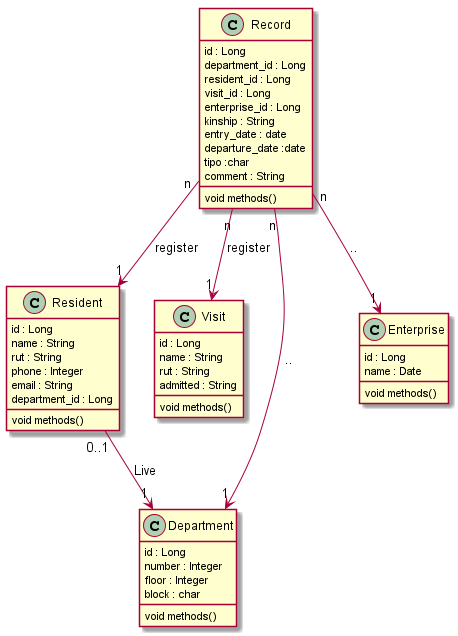
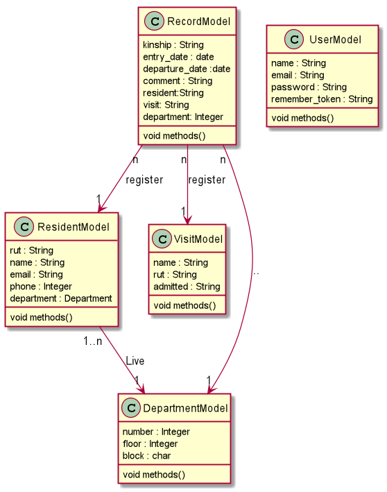

# Concierge

Concierge is a simple universitary application to manage visits and amendments available in PC and Android.

## Subject

Platform-oriented Software Development Project UCN.

## Instructions

For use this app please execute this command in terminal:

 - php artisan serve --host 0.0.0.0 --port=8000
 
Then replace the current ip for your machine ip in [ApiService](./Android/app/src/main/java/com/example/android/service/ApiService.kt) file.

## Autors
```c
Ignacio Chirino Farias ICCI
Gerald Lopez Guitierrez ICCI 
Javier Palacios Arce ICCI
```

## Class Diagram PHP



## Class Diagram Kotlin




## License
[MIT](https://choosealicense.com/licenses/mit/)


## Institution


